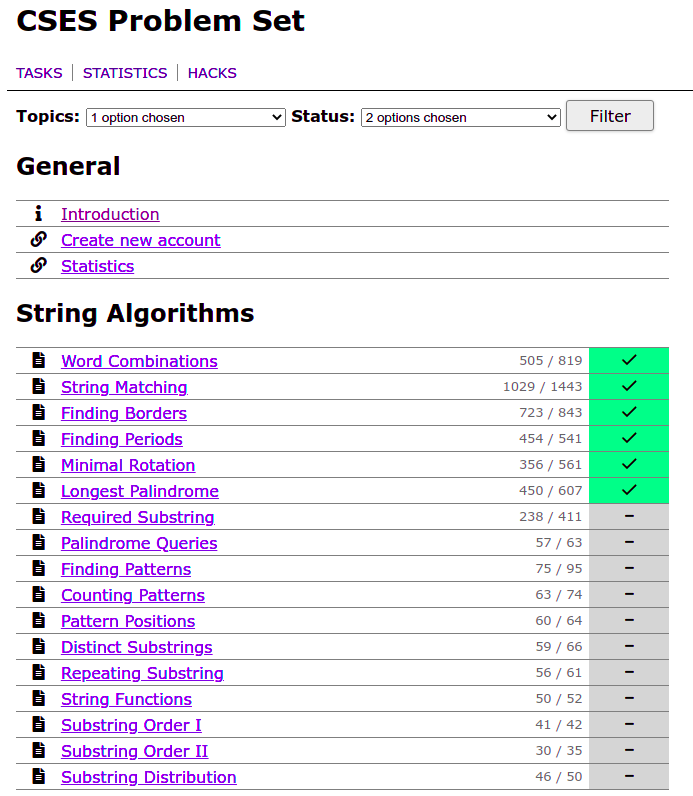

# cses-filter

Browser extension to filter problem set on cses.fi

### Installation

- [Chrome extension installation](https://chrome.google.com/webstore/detail/cses-problem-set-filter/klbfimgoecggkhemnoijobhnmjeoflhb?hl=en)
- [Firefox add-on installation](https://addons.mozilla.org/en-CA/firefox/addon/cses-problem-set-filter/)

### Why

I want to (re)learn javascript ~~and to remind myself why it's bad~~

### Demo

